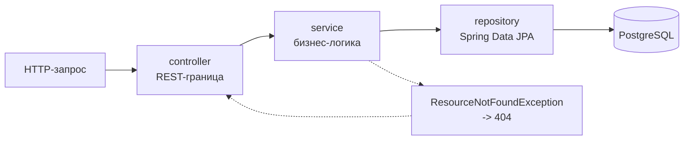

# Beetle Management Service

> **Maintenance status · 2026-08-25: archived coursework, 0 active portfolio hours.**

    

REST-сервис для каталога коллекций жуков: пользователи, экземпляры, предложения обмена.
Kotlin-переписывание Java-версии из [bug-collection](https://github.com/m4themagics/bug-collection) —
та же предметная область и та же схема данных, другой язык и система сборки.

**Стек:** Kotlin · Spring Boot · Spring Data JPA · PostgreSQL · Gradle (Kotlin DSL) · Micrometer/Prometheus

## Зачем два репозитория

`bug-collection` — исходная реализация на Java и Maven. Этот репозиторий — тот же сервис,
переписанный на Kotlin и Gradle Kotlin DSL. Сравнение двух веток одного сервиса показывает,
что меняется при переходе: data-классы вместо POJO с геттерами, nullability в системе типов
вместо аннотаций, `build.gradle.kts` вместо XML.

## Архитектура

Классическое трёхслойное разделение, каждый слой за интерфейсом:

```text
controller/   BeetleController, UserController — HTTP-границa
service/      интерфейсы + Impl — бизнес-логика
repository/   Spring Data JPA — доступ к данным
model/        Beetle, User, ExchangeOffers — сущности
exception/    ResourceNotFoundException — 404 вместо пустого ответа
```

Метрики отдаются через Micrometer, конфигурация Prometheus — в `src/main/resources/prometheus.yaml`.

## Поток запроса



Каждый слой обращается только к соседнему снизу и знает его как интерфейс, а не как
реализацию — поэтому хранилище можно подменить, не трогая контроллеры.

## Запуск

Нужны JDK 17+ и PostgreSQL с базой `BugCollection`.

```bash
./gradlew bootRun
```

Параметры подключения — в `src/main/resources/application.yaml`; подставьте свои
учётные данные. Схема создаётся автоматически (`hibernate.ddl-auto: update`).
Сервис поднимается на порту `8081`.
